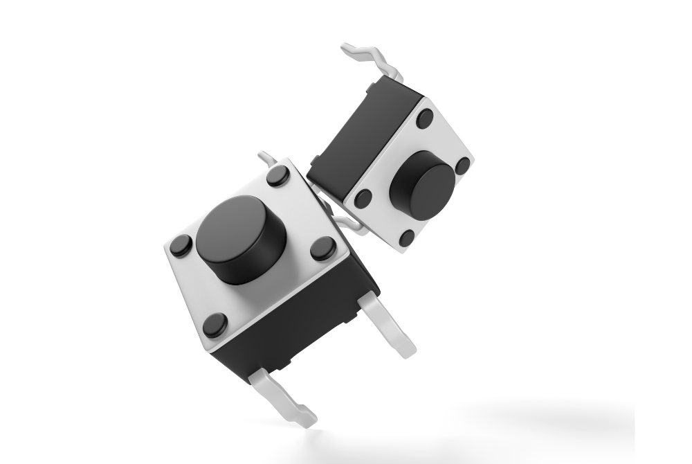
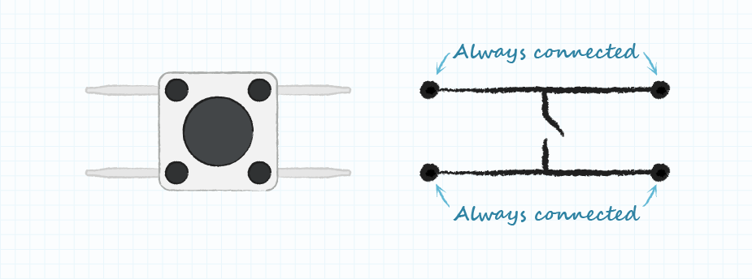
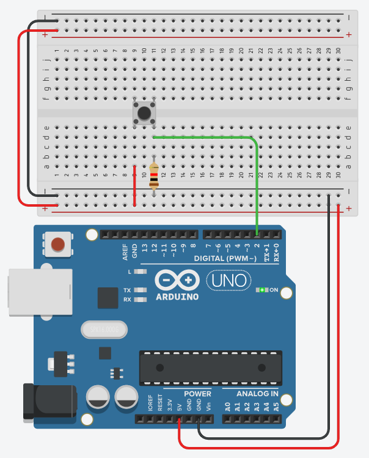

# Button

Buttons, or more accurately switches, are the most common input we use in robotics.





## Wiring

When wiring up a button there are a few elements to note:

- Use a 10K resistor as a **pull down resistor** to increase reliability 
    - Without using one, you might find that it will register inputs at random
- The two pins that are vertically aligned with eachother are actually connected.

        

        

## Code

**Basic Check** - If the button is held in, the arduino's inbuilt LED will turn on (Pin 13)

```c++
int button = 2;

// the setup function runs once when you press reset or power the board
void setup() {  // initialize digital pin 13 as an input.
  pinMode(button, INPUT);
}

// the loop function runs over and over again forever
void loop() {
  int state = digitalRead(button);  //read the state of the button's pin
  if (state)
    digitalWrite(13, HIGH);  // turn the inbuilt LED on
  else {
    digitalWrite(13, LOW);  // turn the inbuilt LED off
  }
}
```


**Toggle LED** - If the button is pressed, it will toggle the state of the inbuilt LED.

```c++
int button = 2;
bool ledState = false;

// the setup function runs once when you press reset or power the board
void setup() {  // initialize digital pin 13 as an output.
  pinMode(button, INPUT);
}

// the loop function runs over and over again forever
void loop() {
  if (digitalRead(button) == HIGH) {
    ledState = !ledState;             // toggle running variable
    digitalWrite(13, ledState);  // indicate via LED
    delay(100);                     // delay to debounce switch
  }
}
```