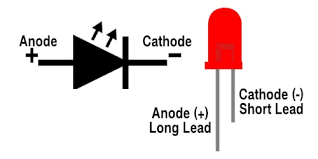

# LED

LED stands for Light Emitting Diode, and they are the most common type of light, and probably the most basic output for an electronic system.



## Wiring

When wiring up an LED there are a few elements to note:

- You should always use a resistor when working with LEDs, as generally the current is too high for them, and will often blow up without one
    - 220 Ω (ohm) resistors are ideal
    - In the diagram below the resistor is connected on the Anode side, but you can connect it on the Cathode side too if you prefer
- LEDs are polarised, meaning there is a correct way to connect them. The **Anode** should be connected to the power source, and the **Cathode** should be connected to ground. There are a few ways to identify the Anode and Cathode
    - The shorter led is the cathode, and should be connected to ground
    - The Anode side has a notch in the circle of the LEDs head
        

        

## Code

**Blink** - turns on an LED on for one second, then off for one second, repeatedly.

```c++
int led = 2;

// the setup function runs once when you press reset or power the board
void setup() {  // initialize the led's pin as an output.
   pinMode(led, OUTPUT);
}

// the loop function runs over and over again forever
void loop() {
   digitalWrite(led, HIGH); // turn the LED on (HIGH is the voltage level)
   delay(1000); // wait for a second
   digitalWrite(led, LOW); // turn the LED off by making the voltage LOW
   delay(1000); // wait for a second
}
```
