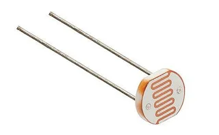
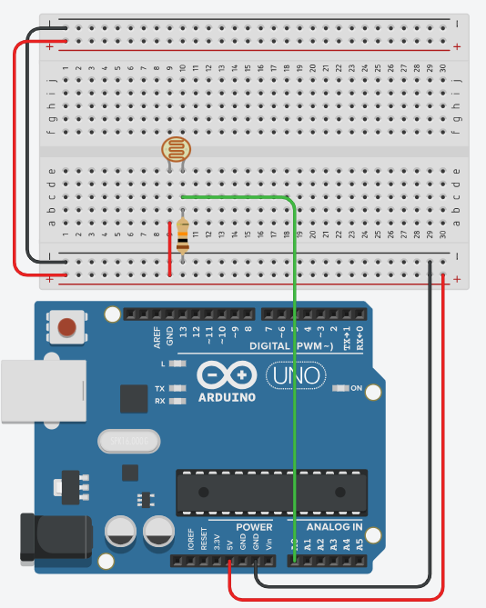

# Photoresistor (LDR)

A photoresistor, or light dependent resistor (LDR) is simply a resistor that changes its' resistance based on the amount of light that is shined on it.



## Wiring

When wiring up a photoresistor there are a few elements to note:

- LDRs require you to wire them with a **pull down resistor**. Connect a 10K resistor to ground on the pin you are reading from. 
    - If you need a different range of values, try a different value resistor

- LDRs are an **analog component**, meaning you need to use an **analog pin** to read their value

        

        

## Code

**Reading Values** - Simply reading values from the LDR's connected pin.

```c++
int ldr = A0;

// the setup function runs once when you press reset or power the board
void setup() {  
  Serial.begin(9600);
}

// the loop function runs over and over again forever
void loop() {
  int value = analogRead(A0);
  Serial.println(value);
}
```


**Checking against Threshold** - Most of the time we will want to do something when the light level is low or high enough. Adjust the ***threshold*** variable to your liking depending on your readings. 
This turns the inbuilt LED on if the light is low enough (and turns it back off if there is enough light).

```c++
int ldr = A0;
int threshold = 500;

// the setup function runs once when you press reset or power the board
void setup() {  
  Serial.begin(9600);
  pinMode(13, OUTPUT);
}

// the loop function runs over and over again forever
void loop() {
  int value = analogRead(A0);
  Serial.println(value);

  if (value < threshold) {
     digitalWrite(13, HIGH);  // turn the inbuilt LED on
  } else{
     digitalWrite(13, LOW);  // turn the inbuilt LED off
  }
}
```